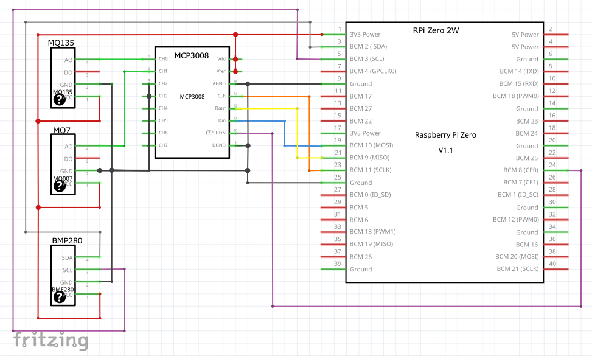
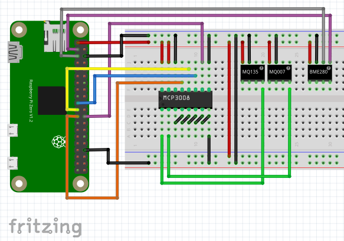
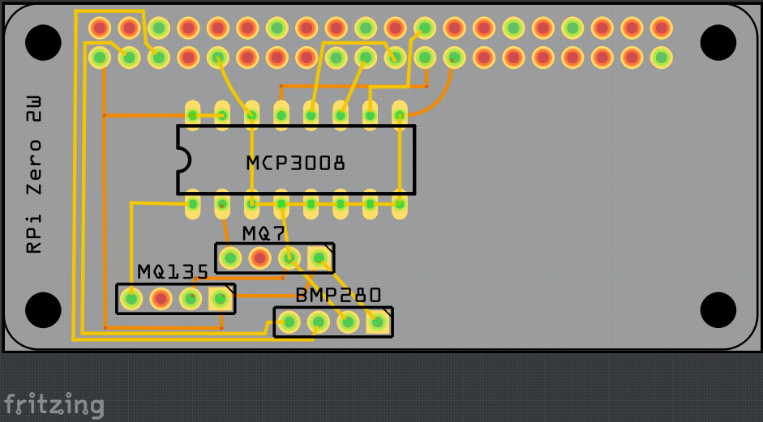

# Sensor Data Logger Using Raspberry Pi Zero 2W, an MCP3008 (ADC) and Various Sensors

## Overview

This project demonstrates connecting up to 8 analog sensors to a Raspberry Pi using the MCP3008 analog-to-digital converter (ADC). It includes data logging, real-time visualization, and support for remote monitoring. The MQ-135 air quality sensor is used as an example. The project also includes I²C integration with a BME/BMP280 sensor for temperature, humidity, and barometric pressure readings.

## Introduction

The Raspberry Pi lacks native analog input pins, so an ADC like the MCP3008 is required for interfacing analog sensors. The MCP3008 allows up to 8 analog devices to be read using the SPI interface. With two MCP3008 chips and chip-select logic, up to 16 analog inputs are possible.

This setup is designed for lab-based data collection. Instead of a GUI installation, the system is designed to run headlessly via a systemd service. It includes a delay allowing sensors (like MQ-series) to warm up.

## MCP3008 Overview

The MCP3008 is a 10-bit ADC with 8 channels, communicating via SPI. It converts analog voltages into digital values ranging from 0 – 1023. For compatibility with the Raspberry Pi's 3.3V GPIO logic, VDD and VREF are both connected to 3.3V. **Resolution** The MCP3008 offers a 10-bit resolution. This means it can divide the analogue input signal into 1024 steps, providing a detailed representation of the analogue signal in digital form. (Value/1024)*3.3

### Power and Ground Connections
Power is connected to incoming power from Buck Converter with low ripple, as possible.

| MCP3008 Pin | Label | Connected To | RPi Pin | Wire Color |
| ----------- | ----- | ------------ | ------- | ---------- |
| 16          | VDD   | 5.0V         | Pin 1   | Red        |  .1uF Capacitor from Pin 16 to Common Ground
| 15          | VREF  | 5.0V         | Pin 1   | Red        |
| 14          | AGND  | Ground       | Pin 6   | Black      |  All Grounds must be connected
| 9           | DGND  | Ground       | Pin 6   | Black      |  All Grounds must be connected

### SPI Connections

| MCP3008 Pin | Signal | RPi GPIO | RPi Pin | SPI Role | Wire Color |
| ----------- | ------ | -------- | ------- | -------- | ---------- |
| 13          | CLK    | GPIO 11  | Pin 23  | SCLK     | Orange     |
| 12          | DOUT   | GPIO 09  | Pin 21  | MISO     | Blue       |
| 11          | DIN    | GPIO 10  | Pin 19  | MOSI     | Green      |
| 10          | CS     | GPIO 08  | Pin 24  | CE0      | Purple     |

### Best Practices

- Use a 0.1 µF decoupling capacitor near VDD (optional but recommended).
- Keep VREF stable and noise-free.
- Unused channels should be grounded to avoid floating inputs.
- SPI speed should be ≤1 MHz. This setup uses 500 kHz.

### SPI 5V to 3.3V Conversion via Logic Level Converter
Logic level converter is placed between incoming lines from a higher voltage to our lower voltage logic processor.  Regards to this project, the SPI lines and the clock signal on the Raspberry Pi side need to be down converted to keep from damaging the Pi.

TXS0108 Power Connections

| TXS0108 Pin | Label | Connected To | RPi Pin | Wire Color | NOTES:                           |
| ----------- | ----- | ------------ | ------- | ---------- | -------------------------------- |
| 01          | VccA  | 3.3V         | Pin 1   | Red        |  1.4-3.6V Supply Voltage    LOW  |
| 10          | OE    | 5.0V         | Pin 1   | Red        |  1.4-3.6V Supply Voltage    LOW  |
| 20          | VBD   | 3.3V         | Pin 6   | Black      |  1.65-5.5V Supply Voltage   HIGH |
| GND         | GND   | Ground       | Pin 6   | Black      |  All Grounds must be connected   |

| MCP3008 Pin | Signal | TXS0108 HSide | LSide | RPi GPIO | RPi Pin | SPI Role | Wire Color |
| ----------- | ------ | ------------- | ----- | -------- | ------- | -------- | ---------- |
| 13          | CLK    | B1            | A1    | GPIO 11  | Pin 23  | SCLK     | Orange     |
| 12          | DOUT   | B2            | A2    | GPIO 09  | Pin 21  | MISO     | Blue       | 
| 11          | DIN    | B3            | A3    | GPIO 10  | Pin 19  | MOSI     | Green      |
| 10          | CS     | B4            | A4    | GPIO 08  | Pin 24  | CE0      | Purple     |

## Sensor Use Example(s)

The MQ-135 sensor outputs an analog signal on its A0 pin. This is connected to CH0 of the MCP3008. Then connected to the high side of the Logic Level converter,  the corresponding Low Side is connected to the RPI. Then, the Python script reads these value records and converts them to a digital value, and then calculates the estimated gas concentration in PPM based on the formula used for sensor accuracy, based on the VREF used.

FORMULA FOR SENSOR ACCURACY EXPLANATION.  THE FORMULA WITH ADJUSTMENTS FROM THE TEMP AND HUMIDITY IS CALCULATED WITHIN THE CODE.

Other sensors (e.g., MQ-7 for CO detection) follow the same pin layout and wiring scheme.

## BME/BMP280 Sensor Integration (I²C)

A BME280 or BMP280 sensor can be connected via I²C to monitor temperature, humidity, and pressure.

### I²C Wiring
This sensor is a 3.3V a sensor, conversion is not required.

| BME/BMP280 Pin | Signal | RPi Pin | I²C Role  | Wire Color |
| -------------- | ------ | ------- | --------- | ---------- |
| VIN            | Power  | Pin 1   |           | Red        |
| GND            | Ground | Pin 6   |           | Black      |
| SCL            | Clock  | Pin 5   | SCL1      | Purple     |
| SDA            | Data   | Pin 3   | SDA1      | Green      |

The sensor is automatically detected via the I²C bus using a Python script and logs reading alongside the analog data.

## Hardware and wiring diagrams

### Schematic Diagram

### Breadboard Layout

### PCB-Design (advanced)

---

## Reference Links

- [MCP3008 Overview](https://www.allelcoelec.com/blog/A-Complete-Overview-of-the-MCP3008-ADC.html)
- [TXS0108 OverView](https://components101.com/modules/txs0108e-bi-directional-logic-level-converter-module)
- [Raspberry Pi GPIO Pinout](https://pinout.xyz/)

- [MQ-7 Datasheet](https://cdn.sparkfun.com/assets/b/b/b/3/4/MQ-7.pdf)
- [MQ-135 Sensor](https://www.elprocus.com/mq135-air-quality-sensor/)
   ...

- [BME280 Python Guide](https://learn.adafruit.com/adafruit-bme280-humidity-barometric-pressure-temperature-sensor-breakout/python-circuitpython)

---

This guide is designed for functional lab deployment of air quality and environmental sensors with a Raspberry Pi. It supports local and remote data logging and visualization using the MCP3008 and I²C-based BME/BMP280 sensors. When calibrated in a lab environment, it measures temperature, humidity, and pressure.  Then, when used normally, the measured temperature and Humidity can be used to correct the measurement from any of the sensors using a calculation.

## Calibration and Environmental Correction

**Important:**  
MQ-series gas sensors (like MQ135, MQ7, etc.) require calibration for accurate readings.  
Sensor accuracy is affected by temperature and humidity.  
**You should:**
- Collect temperature, humidity, and pressure readings (e.g., from a BME280) before using MQ sensor data.
- Apply temperature and humidity corrections to the raw ADC value using a calibration formula, along with your sensor’s load resistance and baseline (R₀).

**Calibration Steps:**
1. **Baseline (R₀) Calculation:**  
   Expose the sensor to clean air and record the resistance (R₀) for your specific sensor.
2. **Environmental Correction:**  
   Use temperature and humidity readings to adjust the gas concentration calculation.  
   This is essential for reliable PPM readings under changing ambient conditions.

**Reference Implementation:**  
See the [MQSensorsLib GitHub repository](https://github.com/miguel5612/MQSensorsLib) for Arduino-based calibration logic, including load resistance, baseline (R₀) calculation, and environmental correction formulas.

**Example Python Libraries:**  
- [Adafruit CircuitPython BME280](https://github.com/adafruit/Adafruit_CircuitPython_BME280)
- [MQSensorsLib (Arduino, for reference)](https://github.com/miguel5612/MQSensorsLib)

